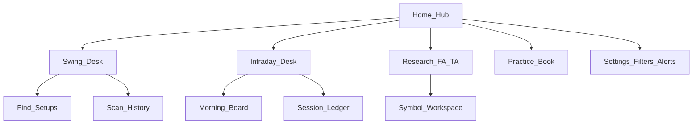
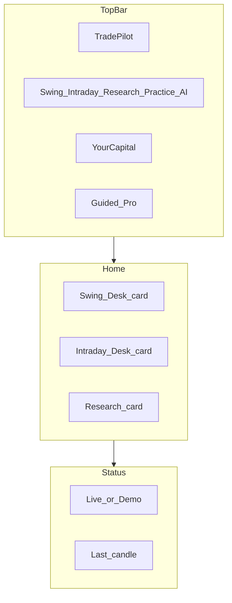
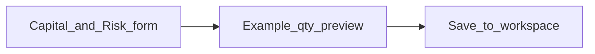
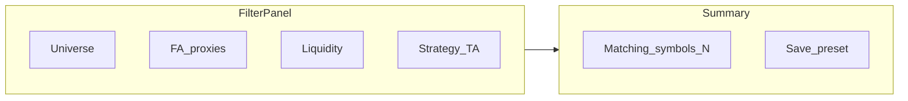
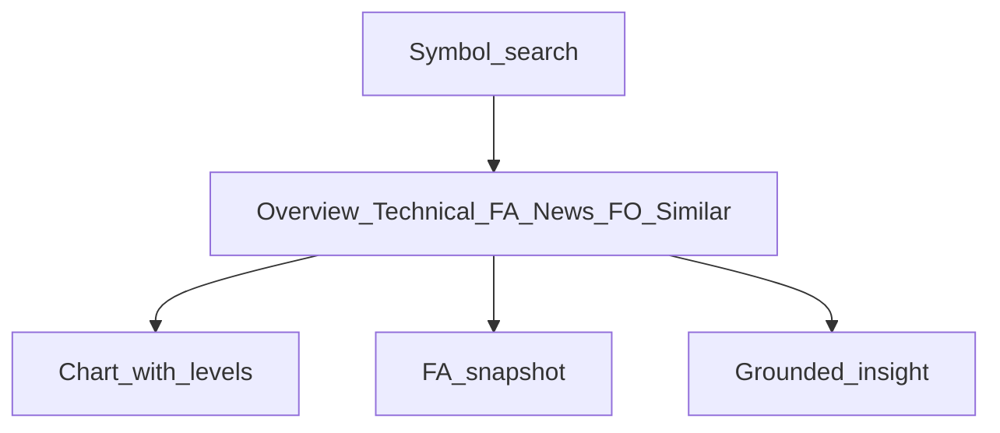
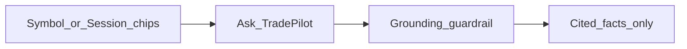
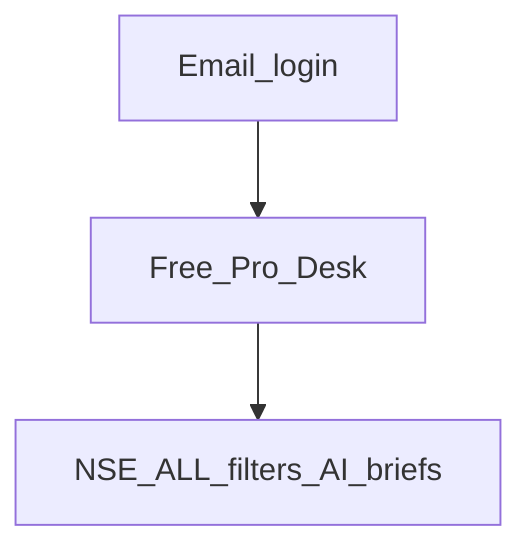

# TradePilot — Product Use Cases & Wireframes

**Product:** TradePilot AI — sellable NSE trading assistant (Swing + Intraday)  
**Audience:** Beginners and experienced traders  
**Universe:** Full NSE cash equities + ETFs; **filtering only inside the app**  
**Status:** Product specification (maps today’s desks to the sellable target)  
**Related:** [PROJECT_PLAN.md](./PROJECT_PLAN.md) · [INTRADAY_STRATEGY_V1.md](./INTRADAY_STRATEGY_V1.md) · [Wireframe assets](./wireframes/README.md)

---

## 1. Vision & constraints

### Vision

TradePilot helps a trader answer:

> Across **all NSE stocks and ETFs I care about** (after *my* filters), what are the valid **swing** and **intraday** opportunities right now—with Entry / risk / size I can trust, explained in plain language?

### Immutable constraints

| Rule | Meaning |
|------|---------|
| Engine owns numbers | Entry, SL, Target, OR high/low, RVOL, qty come from strategies—not the LLM |
| LLM is grounded | AI only rephrases allowlisted facts; never invents prices or fills |
| Not a broker OMS | Practice / paper is fake money; live broker connect is optional later with hard disclaimers |
| Not an autonomous bot | User confirms arms; locks and cutoffs are visible |
| Full NSE master | `NSE_ALL` = cash + ETF; Nifty presets are shortcuts only |
| Dual UX | **Guided** (beginner) and **Pro** (dense tables, reason codes, shortcuts) |

### What “sellable” means here

- Complete desks for Swing, Intraday, Research (FA + TA), Practice, AI Copilot  
- Beginner-safe claims and Pro depth on the same screens  
- Filter-first workflow over the full NSE list  
- Clear data-readiness and coverage (no silent empty scans)

---

## 2. Personas & dual UX

| Persona | Primary jobs | UX mode |
|---------|--------------|---------|
| Beginner | Capital → Find setups / Morning board → understand Why | Guided |
| Swing trader | Scan, rank, paper, research drawer, CSV, briefs | Pro or Guided |
| Intraday trader | Morning board, session ledger, OR chart, practice vs model | Pro |
| Analyst | FA+TA workspace, filters, coverage, backtest interpret | Pro |

**Guided:** one primary CTA, plain labels, “How this works”, outcome chips.  
**Pro:** denser tables, raw reason codes beside labels, keyboard hints, bulk CSV.

---

## 3. Information architecture

**Shared chrome:** Brand · Desk switcher · Your capital · Guided/Pro · Data status (live/demo) · Help.

---

## 4. Filters & NSE_ALL model

Users never shrink the *master list* to trade “only Nifty” unless they choose a preset. They apply **Filter sets**:

| Group | Parameters |
|-------|------------|
| Universe | NSE_ALL · Stocks only · ETFs only · Nifty 50/100/200/500 shortcuts |
| FA proxies | Sector · earnings blackout · exclude CA day · optional mcap band when data exists |
| Liquidity | Min ADV ₹ · min price · max price |
| TA / strategy | Swing BreakoutRetest · Intraday ORB · direction · min score / min RVOL5 |
| Risk | Account equity · risk % · (intraday locks shown read-only from CONFIG_V1) |
| Eligibility | Exclude surveillance · short-allow for shorts only |

Presets example: *Liquid large-cap*, *ETF only*, *High RVOL morning*.

---

## 5. Use cases

Legend: **[Today]** partially/fully in app · **[Target]** sellable gap · Wireframe: PNG for every UC screen (see [wireframes/README.md](./wireframes/README.md)).

---

### A. Onboarding & workspace

#### UC-A1 — First launch / Home Hub
**Goal:** Orient beginner; one path into Swing, Intraday, or Research.  
**Status:** [Today] Home Hub matches UC-A1 wireframe  

**Main flow:** Open app → see three desks → set capital if empty → pick desk.  

**Wireframe asset:** [uc-a1-home-hub.png](./wireframes/uc-a1-home-hub.png)

**Acceptance:** First viewport is one composition (brand + one sentence + three CTAs); not a dense dashboard.

---

#### UC-A2 — Set capital & risk %
**Goal:** Drive all position sizing from one equity + risk %.  
**Status:** [Today] Capital & risk screen matches UC-A2 wireframe  
**Wireframe asset:** [./wireframes/uc-a2-capital-risk.png](./wireframes/uc-a2-capital-risk.png)

**Flow:** Settings or header → enter capital & risk % → see example qty on sample setup.  
**AI:** Risk coach explains “0.5–1% of capital at risk” without changing strategy numbers.

---

#### UC-A3 — Guided vs Pro mode
**Goal:** Same data, two densities.  
**Status:** [Today] Guided vs Pro compare + persisted toggle  
**Wireframe asset:** [./wireframes/uc-a3-guided-pro.png](./wireframes/uc-a3-guided-pro.png)

**Flow:** Toggle Guided/Pro → cards vs dense table preference persisted.

---

#### UC-A4 — Data readiness banner
**Goal:** Never pretend live data when demo/stale.  
**Status:** [Today] Data readiness banner + runbook + coverage gaps  
**Wireframe asset:** [./wireframes/uc-a4-data-readiness.png](./wireframes/uc-a4-data-readiness.png)

**Flow:** Banner shows source, last bar, symbols with 1d/1m; CTA “Refresh data” / runbook link.

---

### B. Universe & filters

#### UC-B1 — Trade full NSE (stocks + ETFs)
**Goal:** Default master = NSE_ALL.  
**Status:** [Today] Universe picker on Swing desk (NSE all / Stocks / ETFs + Nifty shortcuts; live match count) · [Target] shared across desks  

**Wireframe asset:** [./wireframes/uc-b1-nse-all.png](./wireframes/uc-b1-nse-all.png)

---

#### UC-B2 — Build filter set (FA + TA)
**Goal:** Functional + technical filters before any strategy run.  
**Status:** [Today] Swing desk modal with live `/universe/preview` count, Stocks/ETFs checks, ASM/CA toggles, named presets  

**Wireframe asset:** [uc-b2-filter-builder.png](./wireframes/uc-b2-filter-builder.png)

**Acceptance:** Changing filters updates “Matching symbols” before Scan / Morning board.

---

#### UC-B3 — Save / reuse filter presets
**Goal:** One-click recall of filter sets.  
**Status:** [Today] Swing modal — Apply / Edit / Save named presets · live filtered count  

**Wireframe asset:** [./wireframes/uc-b3-filter-presets.png](./wireframes/uc-b3-filter-presets.png)

---

#### UC-B4 — Coverage & skip reasons
**Goal:** Explain why names vanished (no candles, filtered, surveillance, CA).  
**Status:** [Today] Swing Coverage drawer modal · `POST /api/v1/universe/coverage` · CSV export  

**Wireframe asset:** [./wireframes/uc-b4-coverage-skips.png](./wireframes/uc-b4-coverage-skips.png)

---

### C. Swing desk — technical setups

#### UC-C1 — Find setups (scan)
**Goal:** Ranked breakout-retest opportunities NOW on filtered universe.  
**Status:** [Today] C1 desk — criteria bar · Top ideas · Results · Why eligible · Ask TradePilot · coverage footer · Open plan → UC-C2  

**Wireframe asset:** [uc-c1-find-setups.png](./wireframes/uc-c1-find-setups.png)

**Actors:** Swing trader / Beginner  
**Preconditions:** 1d candles for filtered symbols; equity set.  
**Main flow:** Set filters → Find setups → progress → Top ideas + table → open plan.  
**Alternate:** No eligible → empty state with “relax filters” / data coverage.  
**AI:** Why eligible (grounded); quality critique advisory only.

**Acceptance:** Entry/SL/Target match strategy evidence; qty from capital+risk %; CSV export.

---

#### UC-C2 — Inspect eligible plan
**Goal:** Understand one setup completely.  
**Status:** [Today] InspectPlanDesk — Setup details · Strategy Steps · Price action · coverage footer  
**Wireframe asset:** [./wireframes/uc-c2-inspect-plan.png](./wireframes/uc-c2-inspect-plan.png)

**Flow:** Open plan from Top ideas / Results → Entry/SL/Target/R:R/qty → Strategy Steps → chart markers → Full research drawer optional.  
**Acceptance:** Levels match scan evidence; qty from capital+risk %; chart shows entry/stop/target lines + B/R/C markers. · Chart evidence → UC-C3.

---

#### UC-C3 — Chart evidence
**Goal:** See structure, levels, volume context.  
**Status:** [Today] ChartEvidenceDesk — Setup chart · Structure notes (ATR / volume / bars) · coverage footer  
**Wireframe asset:** [./wireframes/uc-c3-chart-evidence.png](./wireframes/uc-c3-chart-evidence.png)

**Flow:** Inspect plan → Chart evidence → candles with Entry/Stop/Target + Support/Ceiling + B/R/C markers · ATR & volume notes · Back to plan.  
**Acceptance:** Levels and markers match scan evidence; volume ratios vs SMA shown; no AI-invented prices.

#### UC-C4 — Forming watchlist
**Goal:** Near-setups not yet confirmed.  
**Status:** [Today] FormingWatchlistDesk — Rank · Stage · Progress · Why waiting · Why watching rail · Ask TradePilot  
**Wireframe asset:** [./wireframes/uc-c4-forming-watchlist.png](./wireframes/uc-c4-forming-watchlist.png)

**Flow:** After Find setups → forming table (progress from bars) → select row → Why watching + Ask → open research for symbol.  
**Acceptance:** No Entry/Stop/Target claimed; stage labels from engine; “Not eligible yet — watch only.”

---

#### UC-C5 — Practice from scan
**Goal:** Opt-in paper watches from eligible.  
**Status:** [Today] PracticeFromScanDesk — select eligibles · Arm selected · Pending/In trade status · price chart · claim banner  
**Wireframe asset:** [./wireframes/uc-c5-practice-from-scan.png](./wireframes/uc-c5-practice-from-scan.png)

**Flow:** After Find setups → check rows → Arm selected for practice → PENDING watches → tick fills at entry.  
**Claim copy:** Practice is fake money—not a brokerage order.  
**API:** `POST /api/v1/paper/arm`

---

#### UC-C6 — Scan history & CSV
**Status:** [Today] Dedicated Swing screen · list + Open + Export CSV  

**Wireframe asset:** [./wireframes/uc-c6-scan-history.png](./wireframes/uc-c6-scan-history.png)

**Flow:** Swing → Scan history (subnav) → select row → summary rail → Open (loads Find setups) or Export CSV.  
**API:** `GET /api/v1/scan/runs` · `GET /api/v1/scan/runs/{id}`  
**Columns:** Date · Universe · Eligible % · Coverage % · Open · Export CSV  

---
#### UC-C7 — Auto-refresh scan
**Status:** [Today] AutoRefreshBar on Find setups · countdown · pauses when criteria/inspect open  

**Wireframe asset:** [./wireframes/uc-c7-auto-refresh.png](./wireframes/uc-c7-auto-refresh.png)

**Flow:** After Find setups → toggle Auto-refresh ON → choose interval → countdown to next scan.  
**Pause rules:** Criteria panel open · Inspect / chart evidence · not on Swing · scan in progress.  
**Persist:** `tradepilot-auto-refresh` in localStorage  

---

### D. Research — Functional + Technical Analysis

#### UC-D1 — Symbol workspace hub
**Goal:** FA + TA for any NSE symbol matching search/filters.  
**Status:** [Today] First-class Symbol Workspace desk · tabs · chart + Evaluate/Backtest · FA snapshot · grounded insight  

**Wireframe asset:** [uc-d1-symbol-workspace.png](./wireframes/uc-d1-symbol-workspace.png)

**Tabs:** Overview · Technical · Fundamentals · News & Events · F&O · Similar · Evaluate

**Flow:** Search NSE symbol → Load → Overview chart with Entry/Stop/Target when evaluate finds a setup → FA snapshot + technical fit + grounded insight.  
**API:** research overview/technical/news/fno/similar/insight · candles · `POST /strategy/evaluate` · `POST /backtest/run`  

---

#### UC-D2 — Technical tab
**Goal:** Structure, S/R, ATR context, setup fit (swing and/or ORB eligibility snapshot).  
**Status:** [Today] Technical tab · Price Chart (S/R + EMA trendline) · Technical Panel (ATR, swing fit, eligible, ORB snapshot/armed) · Evaluate/Backtest  
**Wireframe asset:** [./wireframes/uc-d2-technical-tab.png](./wireframes/uc-d2-technical-tab.png)

---

#### UC-D3 — Fundamentals / overview
**Goal:** Business snapshot + caution flags (not a full DCF).  
**Status:** [Today] Fundamentals tab · business snapshot (sector, quality flags, caution) · FA proxy metrics table · Evaluate/Backtest  
**Wireframe asset:** [./wireframes/uc-d3-fundamentals.png](./wireframes/uc-d3-fundamentals.png)

---

#### UC-D4 — News & events / CA calendar
**Goal:** Avoid trading through dangerous events.  
**Status:** [Today] News Events tab · news list · corporate-actions calendar · trading caution · Eligibility/Filters handoff  
**Wireframe asset:** [./wireframes/uc-d4-news-events.png](./wireframes/uc-d4-news-events.png)

---

#### UC-D5 — F&O context
**Status:** [Today] F&O Context tab · chain / Unavailable · premium · OI change · PCR · wall levels  
**Wireframe asset:** [./wireframes/uc-d5-fno-context.png](./wireframes/uc-d5-fno-context.png)

---

#### UC-D6 — Similar setups / peers
**Status:** [Today] Similar tab · peer cards · Entry/Stop/score · setup family · Compare · grounded-only note  
**Wireframe asset:** [./wireframes/uc-d6-similar-peers.png](./wireframes/uc-d6-similar-peers.png)

---

#### UC-D7 — Single-symbol evaluate + backtest
**Goal:** Run strategy on one name; interpret metrics with grounded AI.  
**Status:** [Today] Evaluate tab · strategy/date controls · chart + Entry/SL/Target · Results (win/trades/Avg R/Max DD) · Backtest interpreter  
**Wireframe asset:** [./wireframes/uc-d7-evaluate-backtest.png](./wireframes/uc-d7-evaluate-backtest.png)

**AI:** Backtest interpreter—summarize; never invent trades.

---

### E. Intraday desk — ORB V1

**Desk overview wireframe:** [uc-e0-intraday-desk-overview.png](./wireframes/uc-e0-intraday-desk-overview.png)

#### UC-E0 — Intraday desk overview
**Goal:** One desk composition — toolbar → morning/eligibility board → outcome chips → ready table → ledger/fills/practice → recent sessions.  
**Status:** [Today] First-class Intraday desk · Morning board / Run session CTAs · Filters · Coverage · More · footer disclaimer  

#### UC-E1 — Morning board (one-click)
**Goal:** Before/during session, see eligible NSE names; **stocks and ETFs ranked separately**.  
**Status:** [Today] Morning board · phase pill · dual Top-N tables · auto-refresh · Strategy Steps (board facts) · blocked sample / hint  

**Wireframe asset:** [uc-e1-morning-board.png](./wireframes/uc-e1-morning-board.png)

**Flow:** Apply filters → Morning board → phase label (pre-OR / OR / live) → dual Top-N tables → auto-refresh.  
**AI:** Optional “explain rank” from RVOL/OR facts only—not a new rank.

---

#### UC-E2 — Pre-09:20 eligibility watchlist
**Goal:** ADV / surveillance / CA / short flags before OR completes.  
**Status:** [Today] Phase-aware Eligibility watchlist · ADV band · Surveillance · CA label · Short-allow · OK / Pending OR / Blocked · provisional note  

**Wireframe asset:** [./wireframes/uc-e2-pre-or-watchlist.png](./wireframes/uc-e2-pre-or-watchlist.png)

---

#### UC-E3 — Run session / ledger
**Goal:** Full day ORB simulation or live path ledger.  
**Status:** [Today] Outcome chips · KPI strip · Ready to trade · Symbol ledger · fills (time/side/fill id) · finished · Pro reason mix  

**Wireframe asset:** [uc-e3-session-ledger.png](./wireframes/uc-e3-session-ledger.png)

**Outcome chips:** ALL · TRADED · ARMED · BLOCKED · SKIPPED  
**Pro:** reason codes + coverage % + reason mix.  
**UI:** Swing-style ready table (rank badge · direction pill · Strategy Steps) + symbol ledger / fills / finished trades.

---

#### UC-E4 — OR evidence chart (1m / 5m)
**Status:** [Today] OrbChart + PlanDeductionPanel modal · 1m/5m · OR facts · Strategy Steps without session  

**Wireframe asset:** [uc-e4-or-evidence.png](./wireframes/uc-e4-or-evidence.png)

---

#### UC-E5 — Practice seed / LTP tick / 15:10
**Status:** [Today] Seed · Tick LTP · Flatten 15:10 · duration timer on open rows · no profit target  

**Wireframe asset:** [uc-e5-practice-fills.png](./wireframes/uc-e5-practice-fills.png)

---

#### UC-E6 — Practice vs model + reconcile
**Status:** [Today] Divergence table · `GET .../practice/reconcile` · halt disables seed/tick  

**Wireframe:** covered with UC-E5 ([uc-e5-practice-fills.png](./wireframes/uc-e5-practice-fills.png))

---

#### UC-E7 — CSV & recent sessions
**Status:** [Today] Recent sessions table · Open · Export CSV · selected session Export  

**Wireframe asset:** [./wireframes/uc-e7-session-csv.png](./wireframes/uc-e7-session-csv.png)

---

### F. AI Copilot (sellable AI)

#### AI capability matrix

| Capability | Allowed | Forbidden |
|------------|---------|-----------|
| Explain eligible / armed setup | Yes — grounded | Invent Entry/SL/Target/OR |
| Invalidation / why blocked | Yes | Override CONFIG_V1 / strategy |
| Plan deduction checklist | Yes | Skip evidence |
| Data-quality coach | Yes | Fake candle coverage |
| Morning/EOD brief | Yes — from scan facts | Promissory returns |
| Ask TradePilot (scoped chat) | Yes — current symbol/session context | General stock tips without context |
| Risk coach | Yes — sizing math | Change risk without user edit |
| Backtest interpreter | Yes | Retune V1 to “make profitable” |
| Compare two names | Yes — grounded fields | Fabricate peer metrics |

#### UC-F1 — Explain this setup
**Goal:** Grounded explanation of one engine setup (Entry/SL/Target + why eligible).  
**Status:** [Paused] Copilot UI / AI chat removed from product shell for now (backend ask API retained)  
**Wireframe asset:** [./wireframes/uc-f1-explain-setup.png](./wireframes/uc-f1-explain-setup.png)

**Flow:** Select setup from Find Setups (or picker) → Copilot explains from engine evidence only → Quick actions or free-form ask (refuse invented prices).  
**API:** `POST /api/v1/ai/ask` (grounded refusals) · scan narrative / evidence fields  

---
#### UC-F2 — Invalidation in plain English
**Goal:** Explain why a setup is blocked or how it invalidates — plain English + checklist; never override CONFIG_V1.  
**Status:** [Today] Find Setups invalidation panel (engine facts only · no chat)  
**Wireframe asset:** [./wireframes/uc-f2-invalidation.png](./wireframes/uc-f2-invalidation.png)

**Flow:** Select setup → structured invalidation panel from engine facts only.  
**API:** scan `invalidation` / `quality_reason` (no Copilot chat)

---

#### UC-F3 — Plan deduction steps
**Status:** [Today] PlanDeductionPanel  

**Wireframe asset:** [./wireframes/uc-f3-plan-deduction.png](./wireframes/uc-f3-plan-deduction.png)

#### UC-F4 — Data-quality copilot
**Status:** [Today] backend critic · [Target] UI coach  

**Wireframe asset:** [./wireframes/uc-f4-data-quality.png](./wireframes/uc-f4-data-quality.png)

#### UC-F5 — Morning / EOD brief
**Status:** [Today] in-app Brief center (template from latest scan · Copy / SES Send email)  

**Wireframe asset:** [./wireframes/uc-f5-brief-center.png](./wireframes/uc-f5-brief-center.png)

#### UC-F6 — Ask TradePilot (scoped Q&A)
**Status:** [Paused] Copilot deferred  

**Wireframe asset:** [uc-f6-ai-copilot.png](./wireframes/uc-f6-ai-copilot.png)

**Acceptance:** If user asks for a price level not in evidence → refuse and point to engine.

#### UC-F7 — Beginner coach mode
**Status:** [Today] Home Guided glossary tips (RVOL / safety exit / intraday exits)  
**Wireframe asset:** [./wireframes/uc-f7-beginner-coach.png](./wireframes/uc-f7-beginner-coach.png)

#### UC-F8 — Backtest interpreter
**Status:** [Today] Research Evaluate interpreter (templated metrics · refuse retune V1)  

**Wireframe asset:** [./wireframes/uc-f8-backtest-interpreter.png](./wireframes/uc-f8-backtest-interpreter.png)

#### UC-F9 — Risk coach
**Status:** [Today] Account → Risk + Capital modal sizing math  

**Wireframe asset:** [./wireframes/uc-f9-risk-coach.png](./wireframes/uc-f9-risk-coach.png)

#### UC-F10 — Compare two names
**Status:** [Today] Compare desk + Research Compare tab (grounded fields only)  

**Wireframe asset:** [./wireframes/uc-f10-compare-names.png](./wireframes/uc-f10-compare-names.png)

---

### G. Practice book, alerts, settings, sellable shell

#### UC-G1 — Unified practice book
**Goal:** One place for swing + intraday practice.  
**Status:** [Today] unified Practice book (Swing/Intraday tabs, stats, claim, detail + pause timer)

**Wireframe asset:** [uc-g1-practice-book.png](./wireframes/uc-g1-practice-book.png)

---

#### UC-G2 — Alerts preferences
**Status:** [Today] Account → Alerts (browser/email/SES/morning/EOD + frequency + preview)  
**Wireframe asset:** [./wireframes/uc-g2-alerts.png](./wireframes/uc-g2-alerts.png)

---

#### UC-G3 — Theme & refresh intervals
**Status:** [Today] Account → Appearance (Light/Dark/System + swing/intraday/practice refresh)  
**Wireframe asset:** [./wireframes/uc-g3-theme-refresh.png](./wireframes/uc-g3-theme-refresh.png)

---

#### UC-G4 — Export / audit trail
**Status:** [Today] Account → Export (scan/session/practice audit table + CSV + audit pack)  
**Wireframe asset:** [./wireframes/uc-g4-export-audit.png](./wireframes/uc-g4-export-audit.png)

---

#### UC-G5 — Account login & plans *(sellable shell)*
**Status:** [Today] Account → Plans (stub login + Free/Pro/Desk selection; auth still stub)  
**Wireframe asset:** [./wireframes/uc-g5-account-plans.png](./wireframes/uc-g5-account-plans.png)

---

#### UC-G6 — Broker connect / paper-only modes
**Status:** [Today] Account → Broker (paper default; connect stub + ack gate)  
**Wireframe asset:** [./wireframes/uc-g6-broker-connect.png](./wireframes/uc-g6-broker-connect.png)

**Claim:** Connecting a broker never auto-fires ORB/swing without explicit user confirm.

---

## 6. End-to-end journeys

### Journey J1 — Beginner morning (Guided)
1. Home → set capital  
2. Filters preset *Liquid large-cap*  
3. Swing Find setups → open Top idea → Strategy Steps → optional Practice  
4. Optional AI: “Explain this setup”

### Journey J2 — Intraday pro open
1. Filters NSE_ALL + min ADV  
2. Morning board → stocks vs ETFs  
3. Run session / watch armed → OR chart  
4. Seed practice → LTP tick → divergence  

### Journey J3 — Analyst FA+TA
1. Research → symbol search  
2. Fundamentals + Technical + News  
3. Evaluate / backtest → AI interpreter  
4. Save filter preset from symbol traits  

---

## 7. Non-functional (sellable)

| Area | Requirement |
|------|-------------|
| Performance | Swing scan async job on NSE_ALL; show progress |
| Data | 1d full master; 1m hybrid active set (see Full NSE plan) |
| Freshness | Scheduled 1d EOD + intraday 1m watermark on active set |
| Claims | Live vs demo always visible |
| Accessibility | Keyboard to primary CTA; contrast for reason chips |
| Safety | LLM kill-switch; paper claim strings |

---

## 8. Sellable MVP vs Later

### MVP (sellable desk)
- NSE_ALL + in-app filters (Swing + Intraday)  
- Guided/Pro toggle  
- Find setups, Morning board, Session ledger, Symbol workspace FA+TA  
- Practice book (unified)  
- Grounded AI explain + Ask TradePilot (scoped) + briefs  
- Coverage / skip reasons  

### Later
- Auth, billing, multi-user  
- Broker OMS / live order route  
- Telegram delivery  
- Deep FA models / earnings forecasts  
- Multi-strategy marketplace  

---

## 9. Traceability (today → target)

| UC group | Today | Target delta |
|----------|-------|--------------|
| A Home / modes | Nav only | Home hub + Guided/Pro |
| B Filters | Universe presets | Shared FA+TA filter builder |
| C Swing | Nifty scan desk | NSE_ALL + filters |
| D Research | Drawer | First-class FA+TA workspace |
| E Intraday | ORB desk | Same + filter parity |
| F AI | Copilot UI paused | Copilot F-series when re-enabled |
| G Product shell | Partial | Unified book + auth wireframes |

---

## 10. Wireframe asset index

Full catalog: [wireframes/README.md](./wireframes/README.md) (45 PNGs).

| File | Use cases |
|------|-----------|
| [uc-a1-home-hub.png](./wireframes/uc-a1-home-hub.png) | UC-A1 |
| [uc-a2-capital-risk.png](./wireframes/uc-a2-capital-risk.png) | UC-A2 |
| [uc-a3-guided-pro.png](./wireframes/uc-a3-guided-pro.png) | UC-A3 |
| [uc-a4-data-readiness.png](./wireframes/uc-a4-data-readiness.png) | UC-A4 |
| [uc-b1-nse-all.png](./wireframes/uc-b1-nse-all.png) | UC-B1 |
| [uc-b2-filter-builder.png](./wireframes/uc-b2-filter-builder.png) | UC-B2 |
| [uc-b3-filter-presets.png](./wireframes/uc-b3-filter-presets.png) | UC-B3 |
| [uc-b4-coverage-skips.png](./wireframes/uc-b4-coverage-skips.png) | UC-B4 |
| [uc-c1-find-setups.png](./wireframes/uc-c1-find-setups.png) | UC-C1 |
| [uc-c2-inspect-plan.png](./wireframes/uc-c2-inspect-plan.png) | UC-C2 |
| [uc-c3-chart-evidence.png](./wireframes/uc-c3-chart-evidence.png) | UC-C3 |
| [uc-c4-forming-watchlist.png](./wireframes/uc-c4-forming-watchlist.png) | UC-C4 |
| [uc-c5-practice-from-scan.png](./wireframes/uc-c5-practice-from-scan.png) | UC-C5 |
| [uc-c6-scan-history.png](./wireframes/uc-c6-scan-history.png) | UC-C6 |
| [uc-c7-auto-refresh.png](./wireframes/uc-c7-auto-refresh.png) | UC-C7 |
| [uc-d1-symbol-workspace.png](./wireframes/uc-d1-symbol-workspace.png) | UC-D1 |
| [uc-d2-technical-tab.png](./wireframes/uc-d2-technical-tab.png) | UC-D2 |
| [uc-d3-fundamentals.png](./wireframes/uc-d3-fundamentals.png) | UC-D3 |
| [uc-d4-news-events.png](./wireframes/uc-d4-news-events.png) | UC-D4 |
| [uc-d5-fno-context.png](./wireframes/uc-d5-fno-context.png) | UC-D5 |
| [uc-d6-similar-peers.png](./wireframes/uc-d6-similar-peers.png) | UC-D6 |
| [uc-d7-evaluate-backtest.png](./wireframes/uc-d7-evaluate-backtest.png) | UC-D7 |
| [uc-e0-intraday-desk-overview.png](./wireframes/uc-e0-intraday-desk-overview.png) | Intraday desk map |
| [uc-e1-morning-board.png](./wireframes/uc-e1-morning-board.png) | UC-E1 |
| [uc-e2-pre-or-watchlist.png](./wireframes/uc-e2-pre-or-watchlist.png) | UC-E2 |
| [uc-e3-session-ledger.png](./wireframes/uc-e3-session-ledger.png) | UC-E3 |
| [uc-e4-or-evidence.png](./wireframes/uc-e4-or-evidence.png) | UC-E4 |
| [uc-e5-practice-fills.png](./wireframes/uc-e5-practice-fills.png) | UC-E5 / UC-E6 |
| [uc-e7-session-csv.png](./wireframes/uc-e7-session-csv.png) | UC-E7 |
| [uc-f1-explain-setup.png](./wireframes/uc-f1-explain-setup.png) | UC-F1 |
| [uc-f2-invalidation.png](./wireframes/uc-f2-invalidation.png) | UC-F2 |
| [uc-f3-plan-deduction.png](./wireframes/uc-f3-plan-deduction.png) | UC-F3 |
| [uc-f4-data-quality.png](./wireframes/uc-f4-data-quality.png) | UC-F4 |
| [uc-f5-brief-center.png](./wireframes/uc-f5-brief-center.png) | UC-F5 |
| [uc-f6-ai-copilot.png](./wireframes/uc-f6-ai-copilot.png) | UC-F6 |
| [uc-f7-beginner-coach.png](./wireframes/uc-f7-beginner-coach.png) | UC-F7 |
| [uc-f8-backtest-interpreter.png](./wireframes/uc-f8-backtest-interpreter.png) | UC-F8 |
| [uc-f9-risk-coach.png](./wireframes/uc-f9-risk-coach.png) | UC-F9 |
| [uc-f10-compare-names.png](./wireframes/uc-f10-compare-names.png) | UC-F10 |
| [uc-g1-practice-book.png](./wireframes/uc-g1-practice-book.png) | UC-G1 |
| [uc-g2-alerts.png](./wireframes/uc-g2-alerts.png) | UC-G2 |
| [uc-g3-theme-refresh.png](./wireframes/uc-g3-theme-refresh.png) | UC-G3 |
| [uc-g4-export-audit.png](./wireframes/uc-g4-export-audit.png) | UC-G4 |
| [uc-g5-account-plans.png](./wireframes/uc-g5-account-plans.png) | UC-G5 |
| [uc-g6-broker-connect.png](./wireframes/uc-g6-broker-connect.png) | UC-G6 |

Mermaid diagrams remain in individual UC sections for flow detail.

---

## 11. Beginner glossary (appendix)

| Term | Plain meaning |
|------|----------------|
| Your capital | Cash you tell TradePilot to size risk from |
| Entry / safety exit / target | Where plan starts, protects, and aims (swing); ORB has no target |
| Opening range | First 5 minutes 09:15–09:20 IST |
| RVOL5 | How busy vs typical first 5 minutes |
| Armed | Passed screen; waiting for breakout |
| Practice | Fake-money simulation |
| Grounded AI | Explains facts already computed—never invents prices |

---

*End of specification. Implementation sequencing continues via Full NSE phases + existing Project Plan Phase 10.*
